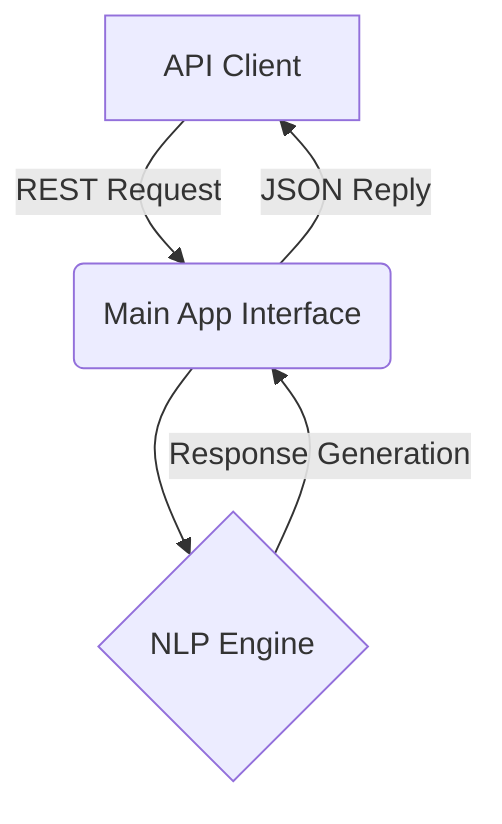

# 🤖 Chat Bot API

A Python-based AI conversational agent backend designed for scalability and rapid integration.

## 🏗 System Architecture
This repository implements a lightweight conversational API using standard Python frameworks.
- **Core Application**: The main application logic resides in `app.py` and `main.py`.
- **Dependency Management**: Fully managed via modern tooling (`uv` / `pyproject.toml`) ensuring reproducible environments.
- **Environment**: Configuration is securely managed through `.env`.



## 🛠 Local Setup & Execution
This project uses `uv` for ultra-fast dependency resolution.

1. **Install uv**: If not installed, get it via `pip install uv`.
2. **Install Dependencies**:
   ```bash
   uv pip install -r requirements.txt
   ```
3. **Run the Application**:
   ```bash
   python main.py
   ```
